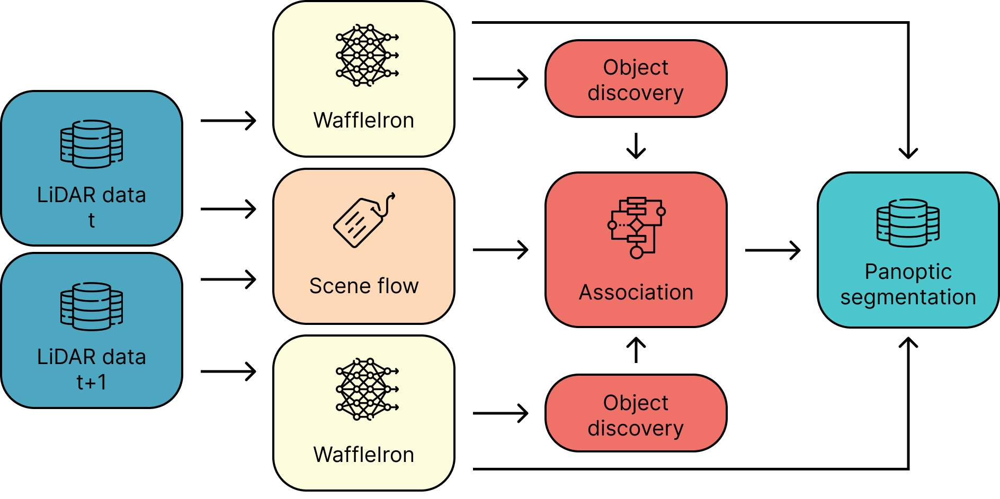
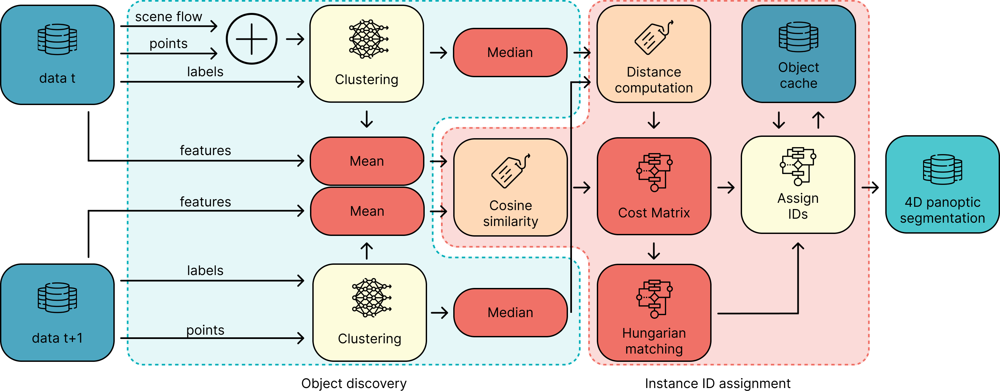

# FlowSeg4D: Online Unsupervised 4D Panoptic Segmentation

FlowSeg4D is a framework for online unsupervised 4D panoptic segmentation, integrating semantic segmentation, scene flow estimation, and instance association.

## Architecture

The FlowSeg4D pipeline comprises three main components:
- **Semantic Segmentation** (yellow)
- **Scene Flow Estimation** (beige)
- **Instance Association** (red)



### Semantic Segmentation

We utilize [WaffleIron](https://github.com/valeoai/waffleiron) models, pretrained using the [ScaLR](https://github.com/valeoai/scalr) method, for semantic segmentation. Currently, only WaffleIron models are supported, but the code can be adapted for other models.

### Scene Flow Estimation

Scene flow estimation is performed using [Let-It-Flow](https://github.com/ctu-vras/let-it-flow), an unsupervised optimization-based model. Due to its high inference time, we recommend precomputing scene flow (see [Precompute Scene Flow](#precompute-scene-flow)).

### Instance Association

The instance association module serves two purposes:
1. **Object Discovery**: Identifies object instances via semantic label-aware clustering, supporting three methods: [Alpine](https://github.com/valeoai/alpine) (default), DBSCAN, and HDBSCAN.
2. **Instance ID Assignment**: Links instances across frames using Hungarian matching with a hand-crafted cost matrix. Two approaches are available:
   - **Naive**: A straightforward association method.
   - **Complex**: Leverages a longer temporal window and per-point feature embeddings for enhanced accuracy.

The following diagram illustrates the detection and association process of the complex approach:



## Installation

### RCI (Recommended)

To install on an RCI system with GPU support:
1. Allocate a GPU to ensure correct installation of CUDA-dependent libraries.
2. Run the installation script to create a virtual environment, install dependencies, and set up a modified WaffleIron repository:

```bash
source install_run.sh
```

3. Activate environment with loading modules via:

```bash
source env_run.sh
```

### Local

Local installation is untested but supported through a `requirements.txt` file. Install dependencies in your environment with:

```bash
pip install -r requirements.txt
```

### WaffleIron Models

To download and extract the WaffleIron models we used run the following script from the repository root:

```bash
bash download_modules.sh
```

Other WaffleIron models should work without code modifications if their configuration files are provided.

## Running FlowSeg4D

FlowSeg4D provides two scripts for processing: one for offline processing and one for online (continuous) processing. Both scripts offer similar functionality, but scene flow estimation is only available in offline mode.

### Offline Setup

Run the offline processing and evaluation with the following command:

```bash
python pan_seg_main.py --dataset DATASET --path_dataset PATH_DATASET [--pretrained_ckpt PRETRAINED_CKPT] [--clustering CLUSTERING] [--flow] [--short] [--save_path SAVE_PATH] [--eval] [--test] [--batch_size BATCH_SIZE] [--use_gt]  [--gpu GPU] [--verbose]
```

-  `--dataset DATASET`: Dataset name.
-  `--path_dataset PATH_DATASET`: Path to dataset.
-  `--pretrained_ckpt PRETRAINED_CKPT`: Path to pretrained ckpt.
-  `--clustering CLUSTERING`: Clustering method.
-  `--flow`: Use flow estimation.
-  `--short`: Use the naive approach.
-  `--save_path SAVE_PATH`: Path to save segmentation files.
-  `--eval`: Run validation split of dataset.
-  `--test`: Run testing split of dataset.
-  `--batch_size BATCH_SIZE`: Batch size.
-  `--use_gt`: Use ground truth labels for semantic segmentation.
-  `--gpu GPU`: Set to a number of gpu to use.
-  `--verbose`: Verbose debug messages.

Supported datasets: *nuScenes*, *SemanticKITTI*.

### Online Setup

Online processing (without evaluation) is implemented in `pan_seg_main.py` via the `PanSegmenter` class, which processes continuous data streams. The class constructor accepts:
- `dataset`: Specify the dataset configuration.
- `clustering`: Specify the clustering algorithm.
- `short`: Use the naive approach.
- `mean_int`: Mean for the intensity value of the point cloud.
- `std_int`: Standard deviation for the intensity of the point cloud.
- `save_path`: Path to save the 4D panoptic segmentations results.
- `gpu`: Set to a number of gpu to use.

The class is called with a dictionary containing:
- `points`: Point cloud with $x,y,z$ coordinates and intensity.
- `ego`: Ego motion transformation matrix.
- `scene`: Scene metadata.
- `sample`: Name of the current frame.

Run the demo with:

```bash
python pan_seg_continuous.py --dataset DATASET --path_dataset PATH_DATASET [--config_pretrain CONFIG_PRETRAIN] [--config_downstream CONFIG_DOWNSTREAM] [--pretrained_ckpt PRETRAINED_CKPT] [--gpu GPU] [--save_path SAVE_PATH] [--clustering CLUSTERING] [--short] [--verbose]
```

Supported datasets: *PONE*, *SemanticKITTI*.

## Additional features
### Visualization

The `scene_vis.py` script visualizes saved segmentation results in SemanticKITTI format. Online visualization is currently not supported.

Run visualization with:

```bash
python scene_vis.py --pcd_dir PCD_DIR --labels_dir LABELS_DIR [--instances] [--dataset DATASET] [--fps FPS] [--frame FRAME]
```

-  `--pcd_dir PCD_DIR`: Directory containing point cloud files.
-  `--labels_dir LABELS_DIR`: Directory containing label files.
-  `--instances`: Flag to indicate if instance labels are used.
-  `--dataset DATASET`: What dataset config to use
-  `--fps FPS`: Frames per second for visualization.
-  `--frame FRAME`: Frame number to visualize. Visualize this frame and five frames after.

Supported datasets: *PONE*, *SemanticKITTI*.
Suported semantic labels: *nuScenes-panoptic*, *SemanticKITTI*.

### Precompute Scene Flow

To procompute the scene flow the following script is provided:

```bash
python precompute_flow.py --dataset DATASET --path_dataset PATH_DATASET --save_dir SAVEDIR [--gpu GPU] [--restart RESTART] [--frame FRAME]
```

- `dataset DATASET`: Dataset to use.
- `path_dataset PATH_DATASET`: Path to the dataset.
- `savedir SAVEDIR`: Directory to save precomputed scene flow data.
- `gpu GPU`: Set to a number of GPU to use.
- `restart RESTART`: Resume scene flow estimation from a specified scene.
- `frame FRAME`: Resume scene flow estimation from a specified frame.

Supported datasets: *nuScenes*, *SemanticKITTI*.
