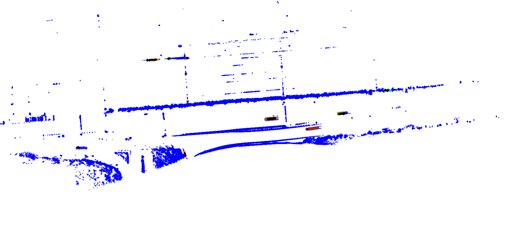

# Instance-aware ICP with gradients to instance probabilities

- Solves ICP on point clouds per-batch with different amount of points in each instance
- Unmatched points (distance loss value) has decreasing instance probability over iterations
- By pluging to the confidence output of the network, such loss will penalize non-matchable instances and dynamically adjust probabilities to explain the masks for the most rigid movements
- Run the following example within the source environment from **4dicp-env.sh** with installed Pytorch3D (from source or module load on RCI): 

```
python instance_icp.py
```
- The script will generate visualization into the **samples** folder with per-object (denoted by colormap) ICP alignment on a toy example.

# Valeo PONE Data with 4D-ICP flow dynamic object detection

- Applies 4D-ICP frame by frame to find changes in center positions
- Reasons about dynamicness based on input parameters

| File Name       | Description                                      |
|-----------------|--------------------------------------------------|
| pone_extract.py | Script for extracting data from PONE dataset files    |
| pone_detect.py | Applies 4D-ICP to segment dynamic instances, resulting in the following image |
| pone_visualizer.py | Starts the gradio server for 3D remote visualization of pone_detect.py outputs, if they are generated|


